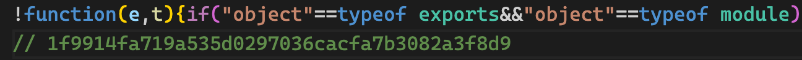
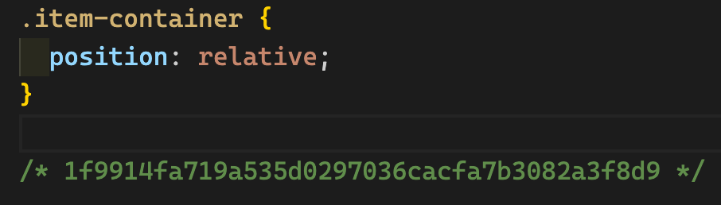
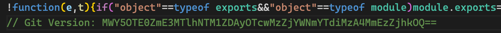

# webpack-git-version-plugin

Write the hash value of the current commit of the code to the js and css chunk file.

## Why

After an online problem occurs in the current project, we need to know the version of the problem code and whether the problem is caused by the cache not being refreshed. Writing the hash value of the current git commit to the file can help us analyze these situations.

## Getting Started

To begin, you'll need to install `webpack-git-version-plugin`:

```shell
$ npm install webpack-git-version-plugin --save-dev
```

Then add the plugin to your `webpack` config. For example:

**webpack.config.js**

```javascript
const GitVersionPlugin = require('webpack-git-version-plugin');

module.exports = {
  plugins: [new GitVersionPlugin()],
};
```

**Example chunk files**

JS file:



CSS file:



## Options

### `processor`

Type: `function` Default: `null`

Function for processing git hash value, which can be used to add prefix or encryption to the output value.

**webpack.config.js**

```javascript
const GitVersionPlugin = require('webpack-git-version-plugin');

module.exports = {
  plugins: [
    new GitVersionPlugin({
      processor: (hashData) =>
        `Git Version: ${Buffer.from(hashData).toString('base64')}`,
    }),
  ],
};
```

The generated chunk file:


